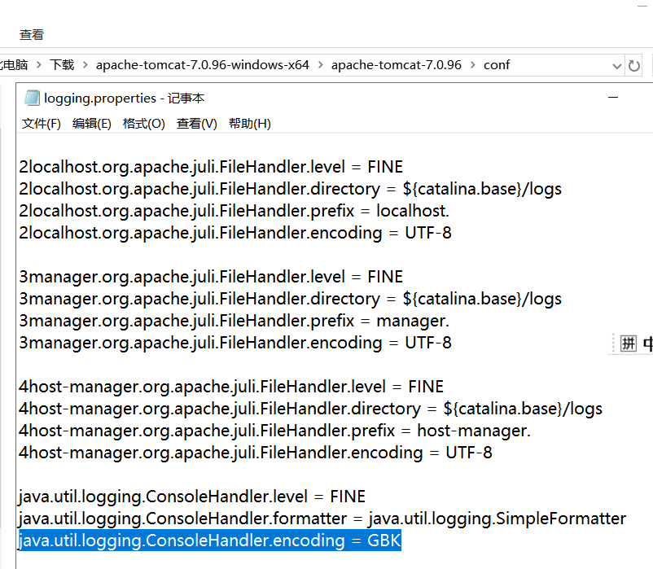
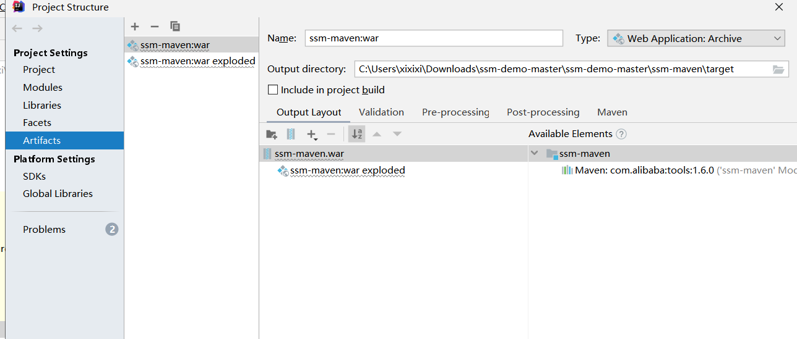

### Idea软件的使用
| 阶段 | 项目计划 |
| :------: | :------: |
|1|配置idea环境|
|2|熟悉各种插件|
|3|掌握使用idea开发一个项目的相关用法|
##### 进度跟踪2.1
> 2.1.1下载Idea软件，根据网上的教程配置Idea（较为简单，通过jar文件即可）（10.11）  
> 2.1.2 配置mysql环境，配置spring-boot环境。（10.14）  
> 2.1.3 maven本地配置，加快maven加载速度。（10.15）  
>> &#9733;配置方法:copy网上分享的settings.xml文件到本机的.m2文件夹中  
>
> 2.1.4 安装tomcat并配置到idea（10.16）  
>> &#9733;配置步骤：idea界面 run>edit configuration>+>more items>tomcat server>自动识别（识别不成功尝试手动配置）  
>
>> &#9733;&#9733;注意事项：
> 1.安装完成后需配置环境变量CATALINA_BASE,CATALINA_HOME及Path。  
> 2.启动时tomcat乱码需修改一下conf/logging.ptoperties的一个语句。

> 2.1.5 Tomcar详细部署的记录(10.21)
> - [x] 配置tomcat的详细部署Artifacts，tomcat的Deployment没有Artifacts的时候是不能run的，这时我们可以从错误提示中打开Artifacts的设置或者是file-projocet struccture-Aritifacts，然后创建一个输出依赖。（10.21）  
   
 > - [x] 对maven项目的运行过程更了解了，双击使用右侧的maven的package生成一个项目的war包，然后Artifacts的Output Layout加上war包后，tomcat上面的Deployment就可以用了。
   
##### 进度跟踪2.2
> 2.2.1了解markdown插件并学习了markdown语法。(10.12)  
> 2.2.2了解git插件，并掌握从idea上传文件到github上面的方法。（10.13）  
> 2.2.3 Idea的全局搜索失灵，解决办法：解决其他快捷键冲突！（10.23）
##### 进度跟踪2.3
> 2.3.1通过导入项目摸索中（10.14）  
> 2.3.2 了解idea的界面  (10.17)
> 
##### 进度跟踪2.4
> 2.4.1 lombok插件（不用自己写getter and setter，但要增加依赖并导入
> #import lombok.Data;