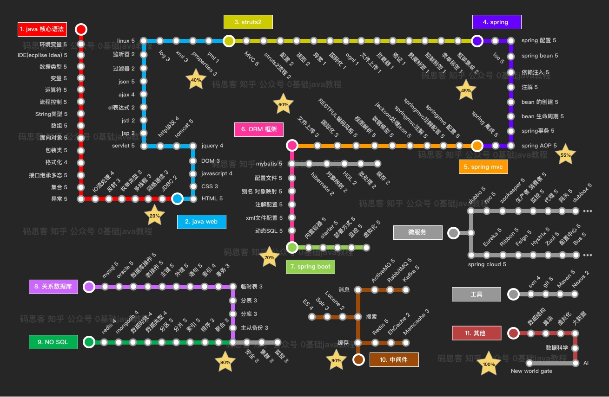

# 学习计划

### 1.spring-boot
| 阶段 | 项目计划 |
| :------: | :------: |
|1|正常运行一个sping-boot开源demo|
|2|结合教程细致分析代码及框架|
|3|自己创建一个项目并运行|
|4|总结分析与强化|
> 点击 [wwww](./SpringBoot进度.md)
### 2.Idea软件的使用
| 阶段 | 项目计划 |
| :------: | :------: |
|1|配置idea环境|
|2|熟悉各种插件|
|3|掌握使用idea开发一个项目的相关用法|  
> 进度点击 [wwww](./Spring Boot快速搭建解析及使用.md)

### 3.Java EE系统知识的学习

- [x] 红色模块 学校课程Java SE基本掌握
- [x] 紫色模块 依据网上的教程及老师的讲解基本掌握
- [ ] 绿色模块 当前任务，但需完成绿色模块还需结合前面未掌握的蓝色模块及黄色模块。计划跟着项目走，画五角星的各个顶点。
