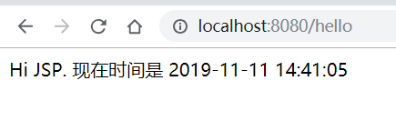
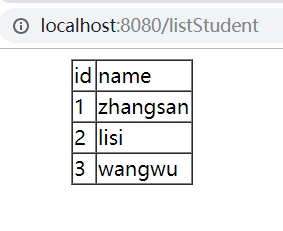

#2019.11.8
#### Spring Boot 快速搭建
- 第一步：新建项目  
*同README.md的“HelloWorld”项目，File-new-project-Spring Initializr(勾选上web模板)*
- 第二步：在main/java/*spingboot(自己设置的名字）包下新建一个【HelloController】  
> 
        @Controller
        public class HelloController {
        @RequestMapping("/hello")
        public class HelloController {
            @RequestMapping("/hello")
            public String hello() {
                return "Hello Spring Boot!";
            }
        }
      }
> 
- 第三步：利用 IDEA 启动 Spring Boot   
*访问 “http://localhost:8080/hello” ，网页显示"Hello Spring Boot!"*  
*&#9733; Spring Boot 内置了 Tomcat,无需自己配置。*  

#### Spring Boot的解析  

- 应用入口类  
Spring Boot 项目通常有一个名为 *Application 的入口类，入口类里有一个 main 方法， 这个 main 方法其实就是一个标准的 Javay 应用的入口方法。  
- Spring Boot 的配置文件(src/main/resources目录下)  
  两种方式： &#9733; application.properties /  &#9733; application.yml （格式不同)  
- Spring Boot 热部署  
往 pom.xml 中添加一个依赖
> <dependency>
     <groupId>org.springframework.boot</groupId>
     <artifactId>spring-boot-devtools</artifactId>
     <optional>true</optional> <!-- 这个需要为 true 热部署才有效 -->
 </dependency>
 重新启动 Spring Boot ，然后修改任意代码，就能观察到控制台的自动重启现象。  
 
 ##### Spring Boot的使用  
 - Spring Boot 支持 JSP（Jsp标签通常以<%开头以%>结尾）  
 1.首先要增加servlet和tomcat的依赖  
 2.修改 application.yml 文件，将我们的 JSP 文件重定向到 /WEB-INF/views/ 目录下；
   >spring：  
     mvc:  
       view:  
         prefix: /web-inf/views/  
         suffix: .jsp  
                                                                                                                                 
 3.修改 HelloController  
 4.新建 hello.jsp 文件 
 运行结果如下  

 - 集成 MyBatis  
 第一步：修改 pom.xml 增加对 MySql和 MyBatis 的支持   
 第二步：新增数据库链接参数（创建好一个student表）  
 > datasource:
       driverClassName: com.mysql.jdbc.Driver
       url: jdbc:mysql://localhost:3307/*student*?allowMultiQueries=true&useUnicode=true&characterEncoding=UTF-8&useSSL=false
       username: root
       password: 777777
>
       jpa:
         hibernate:
           ddl-auto: update  
  第三步：建一个装有student的包，和类student；
  > 此处用到lombok插件，即可不写getter and setter，但要添加依赖，并导入  
import lombok.Data;  

  第四步:建一个 Mapper包，和映射类 StudentMapper
  第五步：新建一个【controller】包，然后在其下创建一个 StudentController类，作为入口  
  第六步：编写 listStudent.jsp 文件，用于获得数据库中的数据
  运行结果如下  
  
以 [我没有三颗心脏]https://www.cnblogs.com/wmyskxz/p/9010832.html）为参考