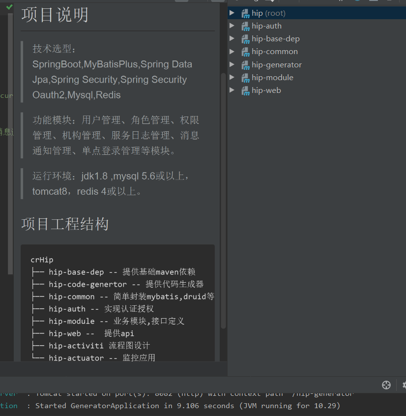

###### 1.教程学习
> 1.1 spingboot教程
>> 点击 [www](./spingboot教程学习.md)  

> 2.1搭建解析及使用spring-boot  
>> 点击 [www](./Spring Boot快速搭建解析及使用.md)
###### 2.项目经历
> 2.1 运行开源项目的demo
>>点击 [www](./运行开源项目的maven_demo.md)  
> 2.2 运行公司正在开发的医院信息集成平台crhip  
>> 步骤：导入项目，下载maven依赖，连接数据库，用springboot内置的tomcat在application函数运行，或者拆除spring boot内置tomcat自己部署本地tomcat  
> 此项目为前后端分离后端项目，无界面
> 
