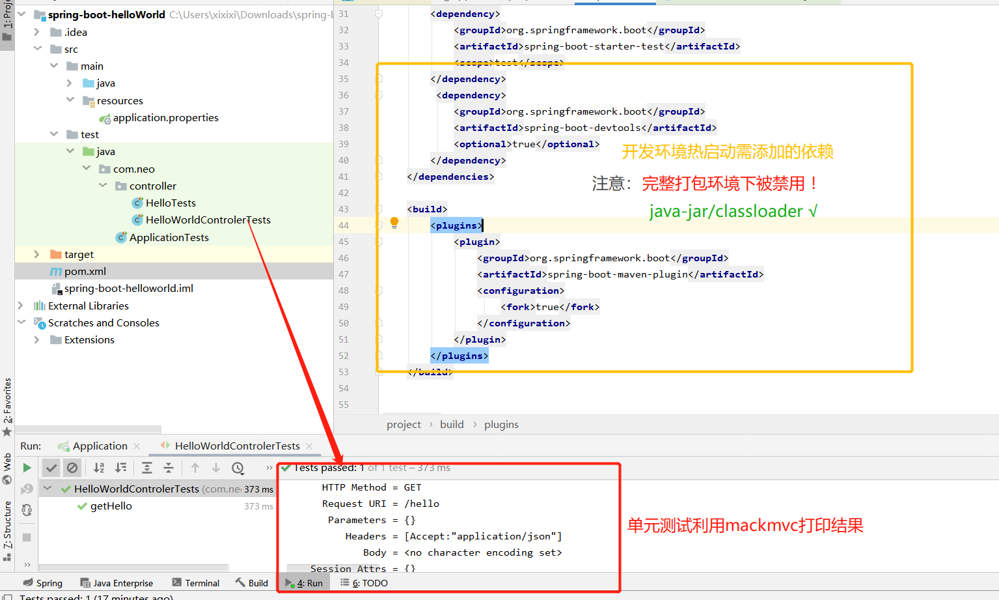
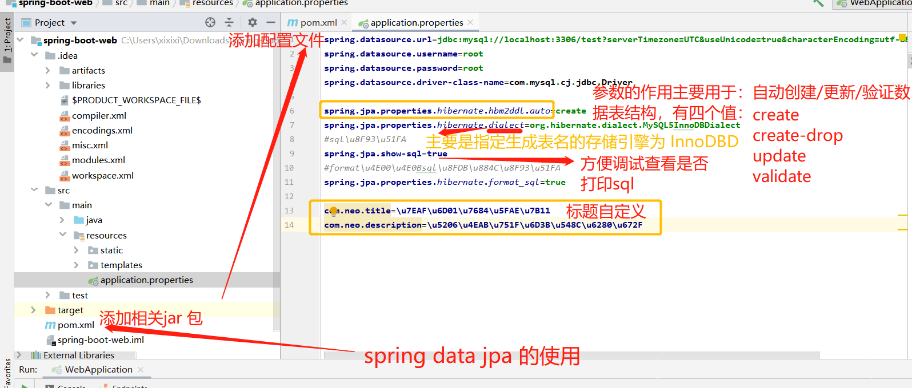
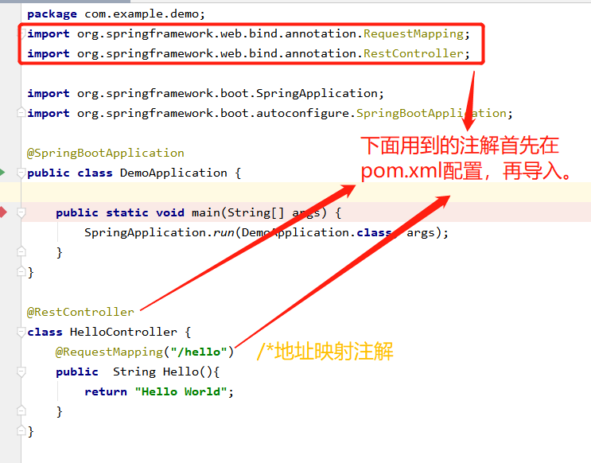

##### 以 [纯洁的微笑](http://www.ityouknow.com/spring-boot.html) 的 Spring Boot 教程为主线了解 Spring Boot）
> 1.1 Spring Boot(一)：入门篇  #笔记（10.23）  
 
> 1.2 Spring Boot(二)：Web 综合开发 #笔记1   
 >  jpa数据操作：利用 Hibernate 生成各种自动化的 sql  
 >  步骤：  
 >> 1.在pom.xml中添加相关jar文件  
 >> 2.在resource的application.properties添加配置文件 如图：  
 >>   
 >> 其中：create： 每次加载 hibernate 时都会删除上一次的生成的表，然后根据你的 model 类再重新来生成新表，哪怕两次没有任何改变也要这样执行，这就是导致数据库表数据丢失的一个重要原因。
       create-drop ：每次加载 hibernate 时根据 model 类生成表，但是 sessionFactory 一关闭,表就自动删除。
       update：最常用的属性，第一次加载 hibernate 时根据 model 类会自动建立起表的结构（前提是先建立好数据库），以后加载 hibernate 时根据 model 类自动更新表结构，即使表结构改变了但表中的行仍然存在不会删除以前的行。要注意的是当部署到服务器后，表结构是不会被马上建立起来的，是要等 应用第一次运行起来后才会。
       validate ：每次加载 hibernate 时，验证创建数据库表结构，只会和数据库中的表进行比较，不会创建新表，但是会插入新值。  
 >> 3.添加实体类和 Dao （dao 只要继承 JpaRepository 类就可以，不用写方法。可以根据方法名来自动的生成 SQL，比如findByUserName 会自动生成一个以 userName 为参数的查询方法，比如 findAlll 自动会查询表里面的所有数据，比如自动分页等等。）  
 >> 4.测试（未成功，解决ing)
#####  hello world项目
> 1.创建并运行一个spring-boot的“hello world”简单项目（10.19）  
  
> - 源代码如下  
  
>- 收获：1.复习了java SE的注解；2.了解了idea新建项目的操作，事实上idea基本是全自动的，一直next到所有文件夹都生成好给你，这与eclipse有较大的区别，我们只需要在已有的结构上添加即可；3.进一步了解了spring-boot的结构，例如发现maven整合了jar包；4.结合昨天运行的demo界面，有一点点灵感可以通过不断添加开发模块将helloworld转变成为多功能的界面。

###### 参考: [我没有三颗心脏]（https://www.cnblogs.com/wmyskxz/p/9010832.html）搭建解析及使用spring-boot
> 具体步骤 [https://github.com/Yojo777/Study-plan]./Spring Boot快速搭建解析及使用.md