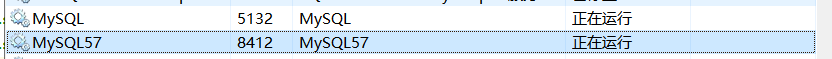

> 1.导入一个开源项目的demo，看的有点迷茫。（10.13）  
> 2.运行成功<https://github.com/ZHENFENG13/ssm-demo>的ssm_maven项目（10.18）
##### spring-boot运行方法（10.22）
 | 方法 | 步骤 |
 | :------: | :------: |
 |1|直接执行起mian方法（课堂上最常用到的方式）|
 |2|用Maven/Gradle插件运行（Maven用到过)|
 |3|打成jar包，通过java-jar命令直接执行|
  
 
>- 注意事项：重启后一定记得打开MySQL服务  
>
>- [ ] 尝试运行ssm_demo_master的demo模块，没有成功。（10.20） 